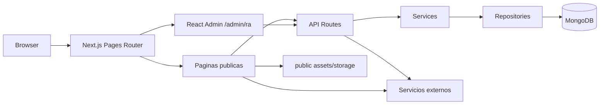
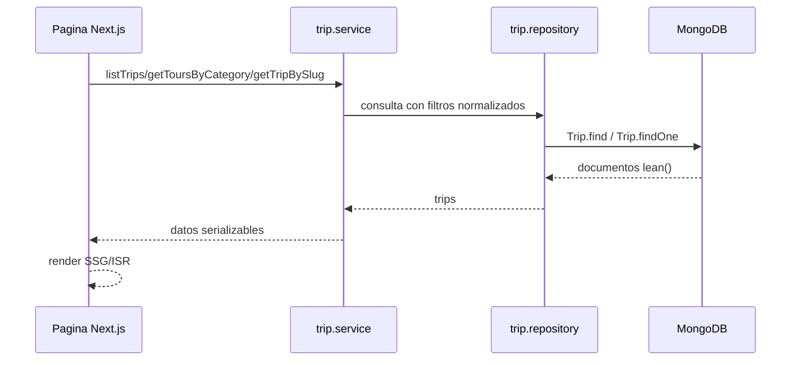
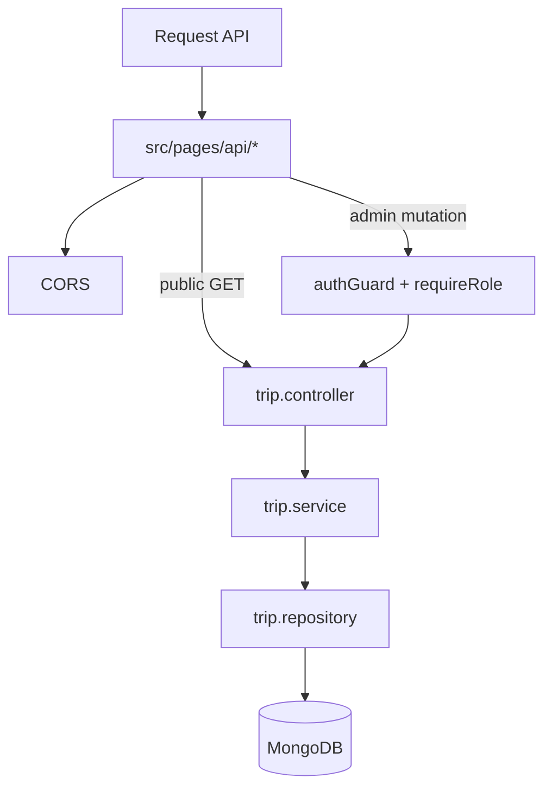
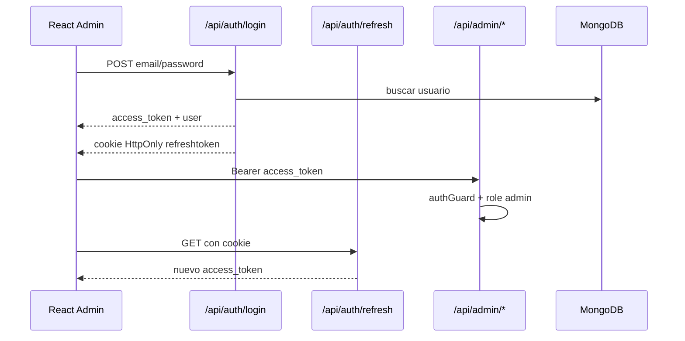

# Architecture

## Vista General

## Capas

- `src/pages`: define rutas públicas, rutas admin, sitemaps y API routes.
- `src/components`: renderiza UI pública, componentes de tours, navbar, footer, formularios y elementos generales.
- `src/modules`: concentra dominio y acceso a datos.
- `src/modules/trips`: controller, service, repository y model para tours.
- `src/modules/auth`: login, refresh token, cookies, JWT y guardas.
- `src/modules/users`: servicios y modelo de usuarios del admin.
- `src/lib`: configuración de marca, MongoDB, constantes, sitemap, GTM, WordPress y API client.
- `src/utils`: helpers transversales para categorías, CORS, imágenes, validación y caché.

## Flujo De Trips Publicos

## Flujo API De Trips

## Autenticacion Admin

## Persistencia

- `Trip` usa colección/modelo `trip` con campos como `title`, `slug`, `category`, `lang`, `price`, `gallery`, `information`, `isDeals`, `discount`, `wetravel`, `meta_title`, `meta_description`, `navbar_description` y otros.
- `User` usa modelo `user` con `name`, `email`, `password`, `role`, `root` y `avatar`.
- `connectDB` cachea la conexión Mongoose en `global.mongoose`.

## Integraciones Externas Confirmadas

- MongoDB por `MONGODB_URI`.
- Resend por `RESEND_API_KEY`.
- reCAPTCHA por `RECAPTCHA_SECRET_KEY` y `NEXT_PUBLIC_RECAPTCHA_SITE_KEY`.
- Google Tag Manager por `NEXT_PUBLIC_GOOGLE_TAG_MANAGER_ID`.
- WeTravel por campo `tour.wetravel`.
- API externa `machupicchuavailability.com` para disponibilidad en slugs específicos.

## Integraciones Pendientes De Confirmar

- WordPress headless: cliente presente, sin uso confirmado en rutas actuales.
- Cloudinary: helpers y variables presentes, pero el flujo admin leído guarda imágenes localmente en `public/storage`.
- PayPal: variable y dependencia presentes, uso activo no confirmado.
