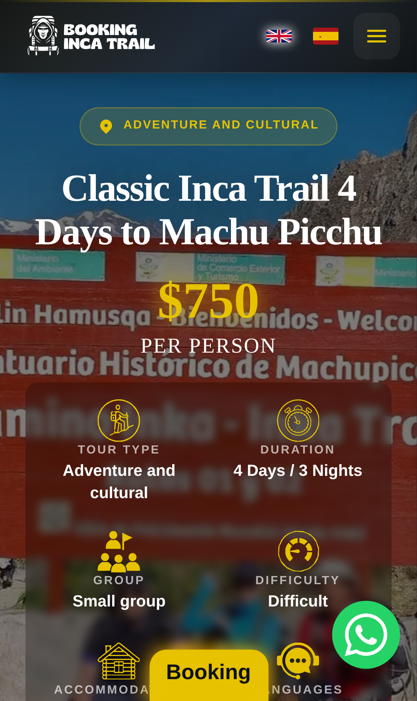
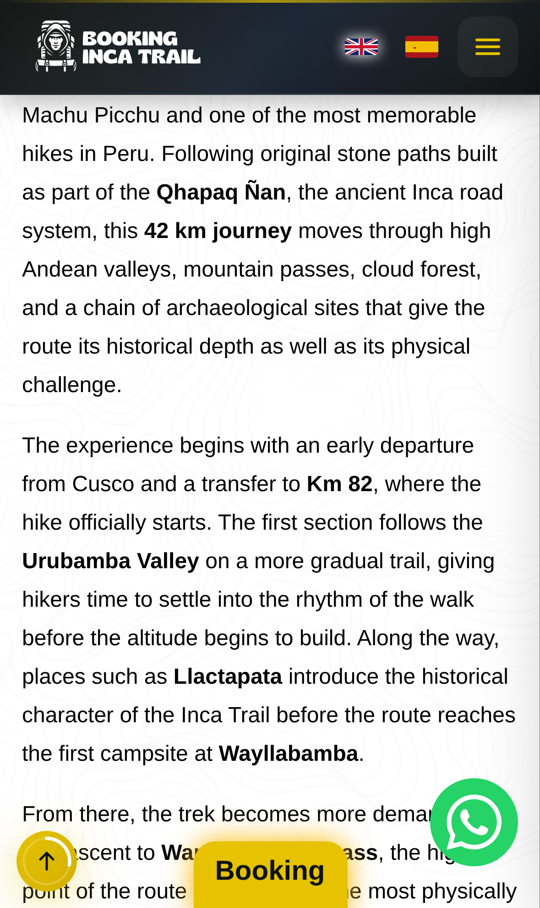
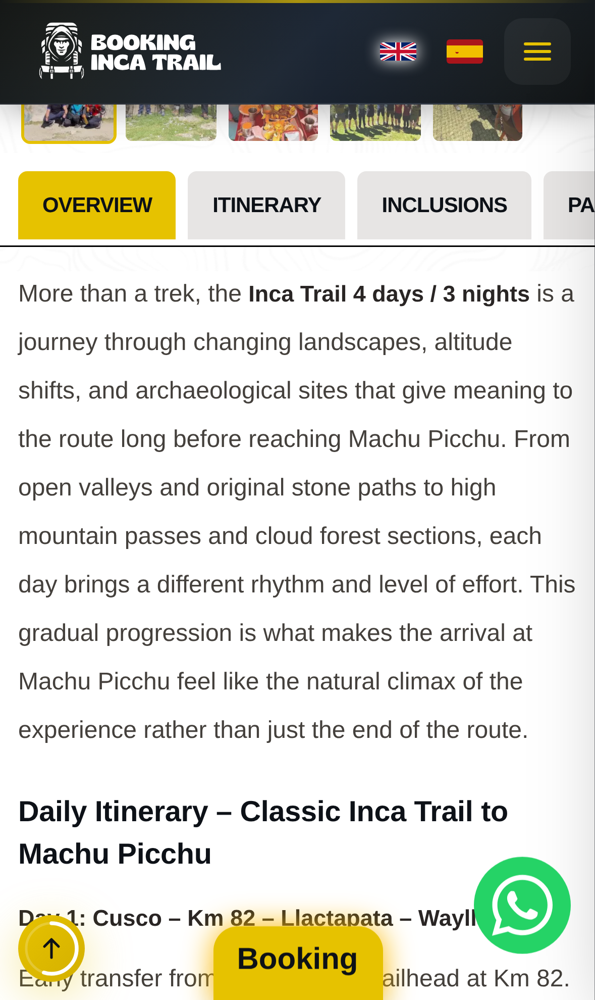
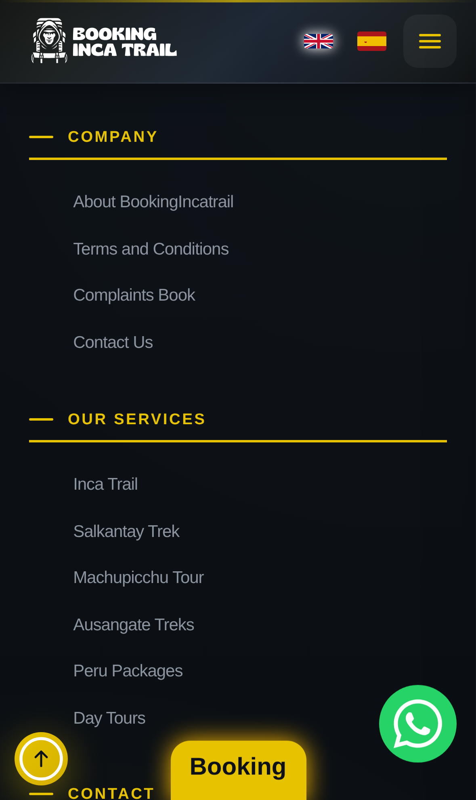

# Rediseño de la Página de Tour — Brief / Anotaciones

> **Propósito.** Este documento es un **brief de diseño** para construir una
> versión **nueva y completamente distinta** de la página de detalle de tour
> (`[travel]/[slug]`) **en otro proyecto**. NO describe cambios sobre el diseño
> actual: el sitio en producción se deja intacto. Aquí se recogen los hallazgos
> de la auditoría móvil, el contrato de datos que el nuevo diseño debe respetar,
> los requisitos de SEO/i18n y una guía de dirección visual.
>
> Referencia de la implementación actual (para no repetir contexto):
> [README.md](./README.md), [01-modelo-datos.md](./01-modelo-datos.md),
> [02-flujo-datos.md](./02-flujo-datos.md), [03-componentes.md](./03-componentes.md),
> [04-estado-interactividad.md](./04-estado-interactividad.md),
> [05-elementos-clave.md](./05-elementos-clave.md).

- **Fecha auditoría:** 2026-07-07
- **Herramienta:** Playwright (Chromium) contra producción `https://bookingincatrail.com`
- **URL EN auditada:** `/inca-trail/classic-inca-trail`
- **URL ES auditada:** `/es/inca-trail/classic-inca-trail`
- **Viewports:** iPhone SE (375×667), iPhone 14 Pro (393×852), Pixel 7 (412×915), iPad Mini (768×1024)

---

## 1. Hallazgos de la auditoría móvil

Capturas de referencia (estado **actual** en producción, iPhone 14 Pro):

| Captura | Qué muestra |
|---------|-------------|
|  | Hero: foto de fondo cargada, quickstats. |
|  | El botón fijo "Booking" **tapa el texto** de la descripción. |
|  | Galería + inicio de secciones de información. |
|  | Itinerario en formato tabs/acordeón. |

### Problemas de UX detectados

| # | Severidad | Problema | Evidencia |
|---|-----------|----------|-----------|
| U1 | 🔴 Alta | **El CTA fijo "Booking" flota sobre el contenido y tapa texto** de la descripción. Compite además con el botón de WhatsApp y el de "subir": 3 elementos flotantes amontonados en la esquina inferior. | Captura 02 |
| U2 | 🟠 Media | **Hero poco legible**: la imagen de fondo es una foto con mucho texto (cartel rojo "Bienvenidos - Welcome"); el H1 blanco cae sobre ese texto → contraste y jerarquía pobres. | Captura 01 |
| U3 | 🟠 Media | **Labels de quickstats se cortan** en pantallas estrechas ("ACCOMMODA…", "…ANGUAGES"); grid de 2 columnas apretado. | Captura 01 |
| U4 | 🟠 Media | **Densidad de texto alta**: párrafos con `line-height` muy grande generan scroll extremadamente largo (página > 20.000 px de alto en móvil). Sin resúmenes ni anclas rápidas en móvil. | Full-page |
| U5 | 🟡 Baja | Dos patrones de navegación de contenido distintos (Tabs en móvil, nav lateral sticky en desktop) → inconsistencia y **doble render** (ver §2 duplicidad). | Código |
| U6 | 🟡 Baja | Sin barra de reserva contextual accesible (precio + CTA) que acompañe el scroll sin tapar contenido. | — |

### Fortalezas a conservar

- Quickstats con iconos (buena señal de escaneo rápido) — solo mejorar layout.
- Calendario de disponibilidad con semáforo (verde/naranja/rojo) — buen concepto.
- Itinerario con navegación por día en desktop (scroll-spy) — mantener idea,
  unificar en responsive.
- Precio grande y visible en el hero.

---

## 2. Duplicidad de contenido (a eliminar en el nuevo diseño)

Hay **dos** tipos de duplicidad; ambos deben resolverse.

### 2.1 Duplicidad en el DOM (móvil vs desktop)

`TourMainContent` renderiza el mismo `tour.information` **dos veces**:

```jsx
<div className="block lg:hidden"><Tabs tabsQuery={tour.information} /></div>
<div className="hidden lg:block"><TourContentDesktop tourInformation={tour.information} /></div>
```

Ambos bloques están en el HTML a la vez (solo se ocultan con CSS). Consecuencias:
- El itinerario/incluye/etc. aparece **duplicado** en el HTML servido → señal
  de contenido repetido y **doble peso** de página.
- Dos componentes que mantienen la **misma** lógica de parseo de HTML
  (`slugify`, `normalizeText`, `isDayHeading`, transform de tags…) copiada en
  `Tabs.js` y `TourContentDesktop.js`.

> **Requisito nuevo diseño:** UN solo componente de contenido, **responsive por
> CSS** (no dos árboles). Renderizar el `information` una única vez y adaptar la
> navegación (tabs/acordeón/nav lateral) con CSS/breakpoints o con un layout
> fluido. Extraer el parseo de HTML a un módulo compartido.

### 2.2 Duplicidad de contenido SEO (idiomas)

Ver §3: hoy EN y ES comparten canonical → Google ve la versión ES como
duplicado de la EN. Debe resolverse con canonical por idioma + hreflang.

---

## 3. Requisitos SEO / i18n (obligatorios)

### 3.1 Estado actual (bugs confirmados en producción)

Extraído con Playwright del HTML servido:

| Señal | Página EN | Página ES | Problema |
|-------|-----------|-----------|----------|
| `<link rel="canonical">` | `…/inca-trail/classic-inca-trail` | `…/inca-trail/classic-inca-trail` | 🔴 **Idéntico**: ES se declara duplicado de EN. |
| `hreflang` alternates | — (ninguno) | — (ninguno) | 🔴 **Faltan** por completo a nivel de página. |
| `<html lang>` | `en` | `en` | 🔴 ES reporta `en` (bug en `_app.js`: usa `pathname`, no `router.locale`). |
| `og:locale` | `es_PE` | `es_PE` | 🟠 Hardcodeado; EN debería ser `en_US`. |
| JSON-LD | 2 bloques | 2 bloques | ✔️ Presente (Product/Breadcrumb…). |

> Contexto i18n del proyecto: `next.config` usa `locales: ['es','en']`,
> `defaultLocale: 'en'`. Por tanto **EN vive en la raíz** (`/inca-trail/slug`) y
> **ES bajo prefijo** (`/es/inca-trail/slug`).

### 3.2 Reglas que el nuevo diseño DEBE cumplir

1. **Canonical por locale** — cada idioma se canoniza a sí mismo:
   - EN → `https://<dominio>/{categoria}/{slug}`
   - ES → `https://<dominio>/es/{categoria}/{slug}`
2. **hreflang recíprocos** en cada página (link tags en `<head>`):
   ```html
   <link rel="alternate" hreflang="en"       href="https://…/{cat}/{slug}" />
   <link rel="alternate" hreflang="es"       href="https://…/es/{cat}/{slug}" />
   <link rel="alternate" hreflang="x-default" href="https://…/{cat}/{slug}" />
   ```
   (Si un tour no existe en un idioma, **no** emitir su alternate.)
3. **`<html lang>` correcto** derivado de `router.locale` (`es` / `en`),
   no del pathname.
4. **`og:locale`** dinámico: `en_US` / `es_PE`; añadir `og:locale:alternate`.
5. **JSON-LD por idioma**: `name`/`description` del schema en el idioma de la
   página; `url` = canonical del idioma.
6. **URLs OG/canonical** construidas con el prefijo de locale (no reutilizar la
   raíz para ES).
7. **Sin duplicidad de DOM** (§2.1): el contenido textual no debe aparecer dos
   veces en el HTML.
8. Mantener sitemap con altern’s hreflang (ya existe `sitemap-en/es`) **coherente**
   con los canonical de página.

### 3.3 Checklist de verificación (post-implementación)

- [ ] `curl`/Playwright: canonical de `/es/...` apunta a `/es/...`.
- [ ] hreflang `en`, `es`, `x-default` presentes y recíprocos en ambas páginas.
- [ ] `<html lang="es">` en páginas ES.
- [ ] `og:locale` = `en_US` en EN, `es_PE` en ES.
- [ ] El texto del itinerario aparece **una sola vez** en el HTML.
- [ ] Rich Results Test valida Product/Breadcrumb/FAQ.

---

## 4. Contrato de datos (a respetar sin cambiar el backend)

El nuevo diseño consume el **mismo** documento `Trip` (MongoDB). No se cambia el
modelo; solo cómo se presenta. Detalle completo en
[01-modelo-datos.md](./01-modelo-datos.md). Resumen de lo que hay que mapear:

| Campo | Tipo | Uso en el nuevo diseño |
|-------|------|------------------------|
| `title` | String | H1 / título hero. |
| `sub_title` | String | Subtítulo / claim. |
| `highlight` | String | Frase destacada. |
| `price` | Number | Precio (USD). Barra de reserva + hero. |
| `duration` | String | Badge de duración. |
| `category` | String | Debe coincidir con `[travel]` (si no → 404). |
| `wetravel` | String (uuid) | Checkout WeTravel. |
| `slug` | String | Ruta + disparador de API de disponibilidad. |
| `description` | String (HTML) | Intro enriquecida (parsear con sanitización). |
| `information` | Array `{title, content(HTML)}` | Secciones: itinerario / incluye / otros. **Render único**. |
| `gallery` | Array `{url, alt}` | `[0]`=hero/OG, resto=galería. |
| `quickstats` | Array `{title, content}` | Datos rápidos (máx 6, icono por posición). |
| `ardiscounts` | Array `{persons, pdiscount}` | Descuentos por grupo. |
| `url_brochure` | String | Botón folleto. |
| `meta_title` / `meta_description` | String | SEO. |
| `discount` / `updatedAt` | Number/Date | Tarjetas de tours similares. |

**Estructuras de arrays** (forma real, ver doc de modelo):

```js
gallery:    [{ url, alt }]              // orden importa: [0]=hero, [last]=flotante
quickstats: [{ title, content }]        // máx 6; icono por índice (STAT_ICONS)
information: [{ title, content }]        // content = HTML; tipo por título
ardiscounts:[{ persons, pdiscount }]    // precio = price * (1 - pdiscount/100)
```

**Detección de secciones de `information`** (mantener en el nuevo diseño):
- título "itinerary/itinerario" → itinerario (extraer "Day N / Día N").
- título contiene "incluye/includes/included" → dividir Incluye / No incluye.
- resto → sección genérica.

**Integraciones a preservar** (ver [05-elementos-clave.md](./05-elementos-clave.md)):
- Disponibilidad en tiempo real (`machupicchuavailability.com`) — solo 3 slugs.
- Reserva: WeTravel (`checkout_embed?uuid=`) / WhatsApp (`51970811976`).
- i18n con diccionarios `@/lang/{en,es}/slug`.
- Marca vía `BRAND` (`brandConfig`).

---

## 5. Guía de diseño UI (dirección propuesta)

> Propuesta de dirección, no imposición. Objetivo: **más atractivo, responsive y
> sin las trampas de UX/SEO del actual**.

### 5.1 Principios

1. **Mobile-first real**: un solo árbol de contenido que fluye por breakpoint.
2. **Jerarquía de reserva clara**: precio + CTA **siempre accesibles** sin tapar
   contenido (barra inferior segura, no botón flotante sobre el texto).
3. **Legibilidad primero**: hero con imagen limpia + overlay de gradiente
   controlado; nada de texto sobre texto.
4. **Escaneabilidad**: resúmenes, chips de datos, anclas de sección también en
   móvil.
5. **Accesibilidad AA**: contraste ≥ 4.5:1, foco visible, `aria` en tabs/acordeón,
   targets táctiles ≥ 44px.

### 5.2 Identidad visual

- **Colores de marca** (heredar): primary verde `#005249`, secondary dorado
  `#e6c200`. Usar dorado solo para acentos/CTA, no como fondo de bloques largos.
- **Tipografía**: display serif (Playfair Display ya en uso) para títulos +
  sans legible (system/Inter) para cuerpo. Cuerpo a `line-height` ~1.6 (no 1.8+).
- **Estilo**: fotografía a sangre + tarjetas con bordes suaves y sombras sutiles;
  evitar saturar de dorado.

### 5.3 Estructura responsive por breakpoint

```
Móvil (<640)          Tablet (≥768)            Desktop (≥1024)
─────────────         ──────────────           ─────────────────────────
Hero (imagen +        Hero a media altura      Hero grande + panel de
 título + precio)      + quickstats en fila      reserva sticky a la derecha
Chips quickstats      Galería en grid 2col     Contenido 2 columnas:
Barra reserva          Contenido + nav           nav lateral sticky + cuerpo
 sticky abajo          por secciones            Galería tipo mosaico
Acordeón secciones    ──────────────           Itinerario con timeline
Itinerario timeline
Similares (carrusel)
FAQ
```

### 5.4 Componentes propuestos (nuevo proyecto)

| Componente | Responsabilidad | Notas |
|------------|-----------------|-------|
| `TourSeoHead` | canonical por locale + hreflang + og + JSON-LD. | Centraliza §3. |
| `TourHero` | imagen limpia, título, precio, badges de duración/dificultad. | Overlay gradiente; sin texto-sobre-texto. |
| `QuickStats` | chips/iconos de datos rápidos. | Wrap fluido, sin cortar labels (U3). |
| `BookingBar` | precio + CTA persistente **sin tapar** contenido. | Barra inferior segura en móvil / panel sticky en desktop (U1, U6). |
| `TourContent` | render **único** de `information` (responsive). | Elimina doble DOM (§2.1). Parseo HTML en módulo compartido + sanitizado. |
| `ItineraryTimeline` | días como timeline con anclas. | Igual UX en móvil y desktop (U5). |
| `IncludesGrid` | Incluye / No incluye en columnas. | Reusa detección de headings. |
| `Gallery` | mosaico + lightbox. | `alt` obligatorio; lazy. |
| `GroupDiscounts` | grid de `ardiscounts`. | Precio calculado. |
| `AvailabilityCalendar` | disponibilidad semáforo + reserva. | Conservar lógica actual. |
| `SimilarTours` | carrusel de la misma categoría. | Reusar contrato de tarjetas. |
| `TourFaqs` | FAQs + JSON-LD FAQPage. | Un solo bloque. |

### 5.5 Jerarquía de CTA (resuelve U1)

```
Móvil:  barra inferior fija segura → [ $750 · Reservar ]   (respeta safe-area,
        no cubre texto; el botón "subir" y WhatsApp se integran o se ocultan
        al mostrarse la barra)
Desktop: panel de reserva sticky en columna derecha (precio, fechas, CTA)
```

### 5.6 Rendimiento y calidad

- ISR + `fallback: 'blocking'` (como hoy) — mantener.
- `next/image` con `sizes` correctos; `gallery[0]` como LCP priorizada.
- Sanitizar el HTML de `description`/`information` (p. ej. `isomorphic-dompurify`,
  ya presente en el proyecto) antes de inyectar.
- Un único parser de HTML compartido (evita la lógica duplicada de
  `Tabs.js` ↔ `TourContentDesktop.js`).
- Lighthouse objetivo móvil: Performance ≥ 90, Accesibilidad ≥ 95, SEO 100.

---

## 6. Criterios de aceptación del nuevo diseño

- [ ] Un solo árbol de contenido (sin duplicado móvil/desktop en el DOM).
- [ ] Canonical por locale + hreflang recíprocos + `x-default`.
- [ ] `<html lang>` y `og:locale` correctos por idioma.
- [ ] CTA de reserva persistente que **nunca** tapa contenido.
- [ ] Hero legible (sin texto sobre texto), contraste AA.
- [ ] Quickstats sin recortes en 320–430px.
- [ ] Responsive verificado en iPhone SE, iPhone 14 Pro, Pixel 7, iPad Mini.
- [ ] Consume el modelo `Trip` sin cambios de backend.
- [ ] Paridad EN/ES completa (contenido + SEO).

---

## 7. Cómo reproducir la auditoría (Playwright)

Playwright quedó instalado como devDependency. Script usado (adaptar URL/viewports):

```js
import { chromium, devices } from 'playwright';
const browser = await chromium.launch();
const ctx = await browser.newContext({ ...devices['iPhone 14 Pro'] });
const p = await ctx.newPage();
await p.goto('https://bookingincatrail.com/inca-trail/classic-inca-trail');
// SEO: leer canonical, hreflang, html lang, og:locale
// Capturas: p.screenshot({ path, fullPage:true }) por viewport
```

> Nota: las capturas de referencia en `./assets/actual-mobile/` reflejan el
> estado en producción a fecha de la auditoría (2026-07-07).
